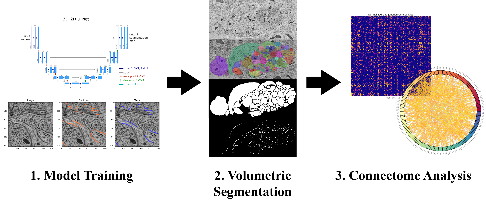

# Gap Junction Connectomics (GJC)
Welcome to the Gap Junction Connectomics Project! This python repository contains all relevant code for 1) training and applying customized CNNs for gap junction semantic segmentation, 2) automated gap junction volumetric inference of any 3D electron microscopy (EM)dataset, and 3) gap junction analysis for characterizing the electrical connectome as a fraction of neuronal contacts. 

Given any EM volume selectively stained for gap junctions and the corresponding neuron segmentation masks, this repo provides the means to explore the electrical connectome of any organism.



Gap junctions are specialized intercellular connections that facilitate direct communication between cells. Semantic segmentation models can be used to identify these proteins from specially-stained electron microscopy images. The [Zhen Lab](https://zhenlab.com/) investigates nervous systems during development, including the electrical coupling of neural circuits through gap junctions. Using EM datasets from adult and dauer (alternative developmental pathway) *C. elegans*, we have developed a pipeline for creating and analyzing 3D segmentation volumes of gap junctions from raw EM volumes. Such volumes enable the exploration of the electrical connectome of these animals, which answer questions related to the structure, function, and plasticity of electrical synapses in neural circuits.

## Getting Started

### Prerequisites
- Python 3.10+
- CUDA-compatible GPU (recommended for training and inference)
- [conda](https://docs.conda.io/en/latest/) or `pip`

### Clone the Repository

```bash
git clone https://github.com/<your-username>/gap-junction-connectomics.git
cd gap-junction-connectomics
```

### Installation

Install the required dependencies:

```bash
pip install -r requirements.txt
```

> **Note:** The `requirements.txt` pins exact versions from a conda environment. For a lighter install, install the core packages manually: `torch`, `torchvision`, `numpy`, `scipy`, `scikit-image`, `opencv-python`, `zarr`, `napari`, and `wandb`.

### Usage

**Training a model:**
```bash
python src/train.py
```

**Running inference on an EM volume:**
```python
from src.segment_dataset import GapJunctionSegmenter

segmenter = GapJunctionSegmenter(...)
segmenter.create_dataset()
segmenter.run_inference()
segmenter.stitch_predictions()
segmenter.stack_slices()
```

**Analyzing the connectome:**
```python
from src.analyze_gj import GapJunctionAnalyzer

analyzer = GapJunctionAnalyzer(...)
analyzer.extract_membranes()
analyzer.expand_neurons()
analyzer.analyze_neurons()
analyzer.analyze_neuron_pairs()
```

---

## Project Structure
```
.
├── notebooks
│   ├── 3d_visualizations.ipynb
│   ├── algo_testing.ipynb
│   ├── catmaid.ipynb
│   ├── inference.ipynb
│   ├── membrane_testing.ipynb
│   ├── sweep.ipynb
│   ├── train.ipynb
│   └── utilities.ipynb
├── src
│   ├── transforms
│   │   ├── gj_membrane.py
│   │   └── transform_objects.py
│   ├── analyze_gj.py
│   ├── inference.py
│   ├── models.py
│   ├── segment_dataset.py
│   ├── sweep.py
│   ├── train.py
│   ├── train_local.py
│   └── utils.py
├── .gitignore
├── README.md
└── requirements.txt

4 directories, 21 files
```

The `notebooks` directory contains Jupyter notebooks used for experimentation and model development. The `src` directory contains the source code for the project, including model definitions, dataset handling, and utility functions. The `transforms` subdirectory contains mainly functions for volumetric transformations such as upsampling/downsampling. Python scripts are intuitively named (e.g., `train.py` for training models, `inference.py` for making predictions using a specific model). The two main classes are `GapJunctionSegmenter` from `segment_dataset.py`, which performs automated gap junction volumetric inference, and `GapJunctionAnalyzer` from `analyze_gj.py`, which extracts gap junction connectivity matrices and normalized statistics.

